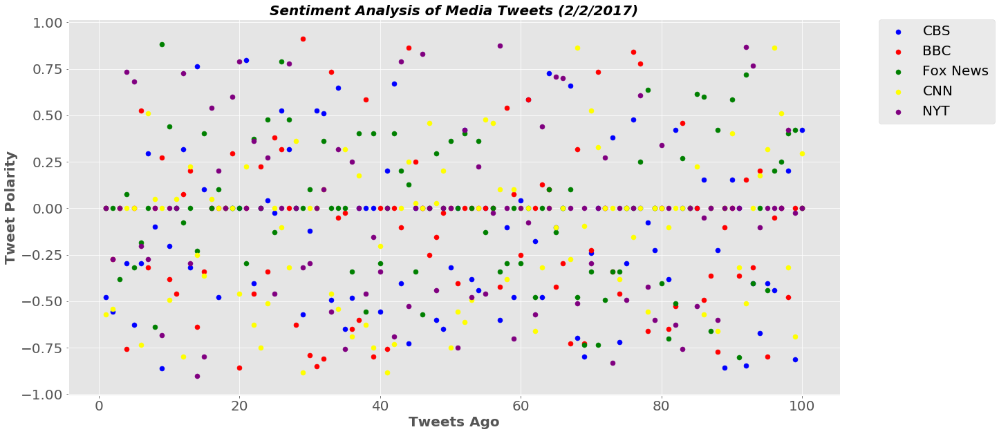
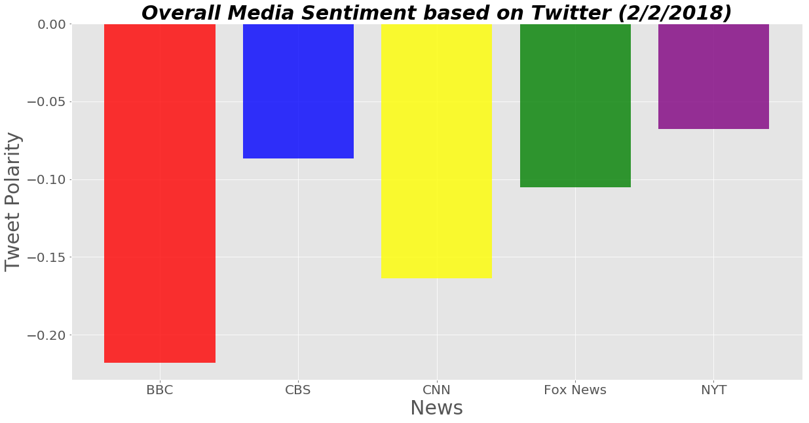

Social-Analytics-Homework
Twitter Analysis

3 Observable Trends based on the data:

1)  All of the sentiments were in the negatives for 2/2/2018, this could be due to breaking news related to politics.

2)  BBC had the worse sentiments while NYT had the best sentiments, NYT had the best sentiments, this could be due to the fact that NYT is not a television news outlet.

3)  Based on the American News television sites, CNN had the worse sentiments and CBS had the best, again, this could be due to the fact that CBS is not a 24hr cable news site.


```python
import tweepy
import json
import pandas as pd
import os
import matplotlib.pyplot as plt
import numpy as np
import seaborn as sns
```


```python
api_dir = os.path.dirname(os.path.dirname(os.path.realpath('_file_')))
file_name = os.path.join(api_dir, "api_keys.json")
data = json.load(open(file_name))

gkey = data['google_places_api_key']
consumer_key = data['twitter_consumer_key']
consumer_secret = data['twitter_consumer_secret']
access_token = data['twitter_access_token']
access_token_secret = data['twitter_access_token_secret']
```


```python
auth = tweepy.OAuthHandler(consumer_key, consumer_secret)
auth.set_access_token(access_token, access_token_secret)
api = tweepy.API(auth, parser=tweepy.parsers.JSONParser())
```


```python
# Import and Initialize Sentiment Analyzer
from vaderSentiment.vaderSentiment import SentimentIntensityAnalyzer
analyzer = SentimentIntensityAnalyzer()

```


```python
#Pull last 100 tweets from each outlet. (@CBSNews,)

# Target Account
CBSNews_user = "@CBSNews"

# Counter
counter = 1

# Variables for holding sentiments
sentiments_CBS = []


# Loop through 5 pages of tweets (total 100 tweets)
for x in range(5):

    # Get all tweets from home feed
    CBSNews_tweets = api.user_timeline(CBSNews_user, page= x+1)

    # Loop through all tweets 
    for tweet in CBSNews_tweets:

       # Print Tweets
        #print("Tweet %s: %s" % (counter, tweet["text"]))
        
        # Run Vader Analysis on each tweet
        compound = analyzer.polarity_scores(tweet["text"])["compound"]
        pos = analyzer.polarity_scores(tweet["text"])["pos"]
        neu = analyzer.polarity_scores(tweet["text"])["neu"]
        neg = analyzer.polarity_scores(tweet["text"])["neg"]
        tweets_ago = counter
        
        # Add sentiments for each tweet into an array
        sentiments_CBS.append({"Date": tweet["created_at"], 
                           "Compound": compound,
                           "Positive": pos,
                           "Negative": neu,
                           "Neutral": neg,
                           "Tweets Ago": counter})
        
        # Add to counter 
        counter = counter + 1


```


```python
#Pull last 100 tweets from each outlet. (@BBCWorld,)

# Target Account
BBCWorld_user = "@BBCWorld"

# Counter
counter = 1

# Variables for holding sentiments
sentiments_BBC = []


# Loop through 5 pages of tweets (total 100 tweets)
for x in range(5):

    # Get all tweets from home feed
    BBCWorld_tweets = api.user_timeline(BBCWorld_user, page= x+1)

    # Loop through all tweets 
    for tweet in BBCWorld_tweets:

       # Print Tweets
        #print("Tweet %s: %s" % (counter, tweet["text"]))
        
        # Run Vader Analysis on each tweet
        compound = analyzer.polarity_scores(tweet["text"])["compound"]
        pos = analyzer.polarity_scores(tweet["text"])["pos"]
        neu = analyzer.polarity_scores(tweet["text"])["neu"]
        neg = analyzer.polarity_scores(tweet["text"])["neg"]
        tweets_ago = counter
        
        # Add sentiments for each tweet into an array
        sentiments_BBC.append({"Date": tweet["created_at"], 
                           "Compound": compound,
                           "Positive": pos,
                           "Negative": neu,
                           "Neutral": neg,
                           "Tweets Ago": counter})
        
        # Add to counter 
        counter = counter + 1


```


```python
#Pull last 100 tweets from each outlet. (@CNN,)

# Target Account
CNN_User = "@CNN"

# Counter
counter = 1

# Variables for holding sentiments
sentiments_CNN = []


# Loop through 5 pages of tweets (total 100 tweets)
for x in range(5):

    # Get all tweets from home feed
    CNN_tweets = api.user_timeline(CNN_User, page= x+1)

    # Loop through all tweets 
    for tweet in CNN_tweets:

       # Print Tweets
        #print("Tweet %s: %s" % (counter, tweet["text"]))
        
        # Run Vader Analysis on each tweet
        compound = analyzer.polarity_scores(tweet["text"])["compound"]
        pos = analyzer.polarity_scores(tweet["text"])["pos"]
        neu = analyzer.polarity_scores(tweet["text"])["neu"]
        neg = analyzer.polarity_scores(tweet["text"])["neg"]
        tweets_ago = counter
        
        # Add sentiments for each tweet into an array
        sentiments_CNN.append({"Date": tweet["created_at"], 
                           "Compound": compound,
                           "Positive": pos,
                           "Negative": neu,
                           "Neutral": neg,
                           "Tweets Ago": counter})
        
        # Add to counter 
        counter = counter + 1


```


```python
#Pull last 100 tweets from each outlet. (@FoxNews,)

# Target Account
FoxNews_User = "@FoxNews"

# Counter
counter = 1

# Variables for holding sentiments
sentiments_FoxNews = []


# Loop through 5 pages of tweets (total 100 tweets)
for x in range(5):

    # Get all tweets from home feed
    FoxNews_tweets = api.user_timeline(FoxNews_User, page= x+1)

    # Loop through all tweets 
    for tweet in FoxNews_tweets: 

       # Print Tweets
        #print("Tweet %s: %s" % (counter, tweet["text"]))
        
        # Run Vader Analysis on each tweet
        compound = analyzer.polarity_scores(tweet["text"])["compound"]
        pos = analyzer.polarity_scores(tweet["text"])["pos"]
        neu = analyzer.polarity_scores(tweet["text"])["neu"]
        neg = analyzer.polarity_scores(tweet["text"])["neg"]
        tweets_ago = counter
        
        # Add sentiments for each tweet into an array
        sentiments_FoxNews.append({"Date": tweet["created_at"], 
                           "Compound": compound,
                           "Positive": pos,
                           "Negative": neu,
                           "Neutral": neg,
                           "Tweets Ago": counter})
        
        # Add to counter 
        counter = counter + 1


```


```python
#sentiments_FoxNews
```


```python
#Pull last 100 tweets from each outlet. (@nytimes,)

# Target Account
NYT_User = "@nytimes"

# Counter
counter = 1

# Variables for holding sentiments
sentiments_NYT = []


# Loop through 5 pages of tweets (total 100 tweets)
for x in range(5):

    # Get all tweets from home feed
    NYT_tweets = api.user_timeline(NYT_User, page= x+1)

    # Loop through all tweets 
    for tweet in NYT_tweets: 

       # Print Tweets
        #print("Tweet %s: %s" % (counter, tweet["text"]))
        
        # Run Vader Analysis on each tweet
        compound = analyzer.polarity_scores(tweet["text"])["compound"]
        pos = analyzer.polarity_scores(tweet["text"])["pos"]
        neu = analyzer.polarity_scores(tweet["text"])["neu"]
        neg = analyzer.polarity_scores(tweet["text"])["neg"]
        tweets_ago = counter
        
        # Add sentiments for each tweet into an array
        sentiments_NYT.append({"Date": tweet["created_at"], 
                           "Compound": compound,
                           "Positive": pos,
                           "Negative": neu,
                           "Neutral": neg,
                           "Tweets Ago": counter})
        
        # Add to counter 
        counter = counter + 1

```


```python
 # Convert sentiments to DataFrame CBS
sentiments_CBS_pd = pd.DataFrame.from_dict(sentiments_CBS)
sentiments_CBS_pd.to_csv("CBS Sentiment.csv")
sentiments_CBS_pd.head()
```


<div>
<style>
    .dataframe thead tr:only-child th {
        text-align: right;
    }

    .dataframe thead th {
        text-align: left;
    }

    .dataframe tbody tr th {
        vertical-align: top;
    }
</style>
<table border="1" class="dataframe">
  <thead>
    <tr style="text-align: right;">
      <th></th>
      <th>Compound</th>
      <th>Date</th>
      <th>Negative</th>
      <th>Neutral</th>
      <th>Positive</th>
      <th>Tweets Ago</th>
    </tr>
  </thead>
  <tbody>
    <tr>
      <th>0</th>
      <td>-0.4767</td>
      <td>Fri Feb 02 22:33:54 +0000 2018</td>
      <td>0.618</td>
      <td>0.251</td>
      <td>0.131</td>
      <td>1</td>
    </tr>
    <tr>
      <th>1</th>
      <td>-0.5574</td>
      <td>Fri Feb 02 22:10:55 +0000 2018</td>
      <td>0.777</td>
      <td>0.223</td>
      <td>0.000</td>
      <td>2</td>
    </tr>
    <tr>
      <th>2</th>
      <td>0.0000</td>
      <td>Fri Feb 02 21:52:31 +0000 2018</td>
      <td>1.000</td>
      <td>0.000</td>
      <td>0.000</td>
      <td>3</td>
    </tr>
    <tr>
      <th>3</th>
      <td>-0.2960</td>
      <td>Fri Feb 02 21:45:02 +0000 2018</td>
      <td>0.885</td>
      <td>0.115</td>
      <td>0.000</td>
      <td>4</td>
    </tr>
    <tr>
      <th>4</th>
      <td>-0.6249</td>
      <td>Fri Feb 02 21:28:03 +0000 2018</td>
      <td>0.806</td>
      <td>0.194</td>
      <td>0.000</td>
      <td>5</td>
    </tr>
  </tbody>
</table>
</div>


```python
 # Convert sentiments to DataFrame BBC
sentiments_BBC_pd = pd.DataFrame.from_dict(sentiments_BBC)
sentiments_BBC_pd.to_csv("BBC Sentiment.csv")
sentiments_BBC_pd.head()
```


<div>
<style>
    .dataframe thead tr:only-child th {
        text-align: right;
    }

    .dataframe thead th {
        text-align: left;
    }

    .dataframe tbody tr th {
        vertical-align: top;
    }
</style>
<table border="1" class="dataframe">
  <thead>
    <tr style="text-align: right;">
      <th></th>
      <th>Compound</th>
      <th>Date</th>
      <th>Negative</th>
      <th>Neutral</th>
      <th>Positive</th>
      <th>Tweets Ago</th>
    </tr>
  </thead>
  <tbody>
    <tr>
      <th>0</th>
      <td>0.0000</td>
      <td>Fri Feb 02 22:22:23 +0000 2018</td>
      <td>1.000</td>
      <td>0.000</td>
      <td>0.0</td>
      <td>1</td>
    </tr>
    <tr>
      <th>1</th>
      <td>-0.2732</td>
      <td>Fri Feb 02 22:22:08 +0000 2018</td>
      <td>0.769</td>
      <td>0.231</td>
      <td>0.0</td>
      <td>2</td>
    </tr>
    <tr>
      <th>2</th>
      <td>0.0000</td>
      <td>Fri Feb 02 21:13:05 +0000 2018</td>
      <td>1.000</td>
      <td>0.000</td>
      <td>0.0</td>
      <td>3</td>
    </tr>
    <tr>
      <th>3</th>
      <td>-0.7579</td>
      <td>Fri Feb 02 20:43:20 +0000 2018</td>
      <td>0.519</td>
      <td>0.481</td>
      <td>0.0</td>
      <td>4</td>
    </tr>
    <tr>
      <th>4</th>
      <td>0.0000</td>
      <td>Fri Feb 02 18:43:23 +0000 2018</td>
      <td>1.000</td>
      <td>0.000</td>
      <td>0.0</td>
      <td>5</td>
    </tr>
  </tbody>
</table>
</div>


```python
 # Convert sentiments to DataFrame CNN
sentiments_CNN_pd = pd.DataFrame.from_dict(sentiments_CNN)
sentiments_CNN_pd.to_csv("CNN Sentiment.csv")
sentiments_CNN_pd.head()
```


<div>
<style>
    .dataframe thead tr:only-child th {
        text-align: right;
    }

    .dataframe thead th {
        text-align: left;
    }

    .dataframe tbody tr th {
        vertical-align: top;
    }
</style>
<table border="1" class="dataframe">
  <thead>
    <tr style="text-align: right;">
      <th></th>
      <th>Compound</th>
      <th>Date</th>
      <th>Negative</th>
      <th>Neutral</th>
      <th>Positive</th>
      <th>Tweets Ago</th>
    </tr>
  </thead>
  <tbody>
    <tr>
      <th>0</th>
      <td>-0.5709</td>
      <td>Fri Feb 02 22:27:04 +0000 2018</td>
      <td>0.862</td>
      <td>0.138</td>
      <td>0.0</td>
      <td>1</td>
    </tr>
    <tr>
      <th>1</th>
      <td>-0.5410</td>
      <td>Fri Feb 02 22:26:51 +0000 2018</td>
      <td>0.851</td>
      <td>0.149</td>
      <td>0.0</td>
      <td>2</td>
    </tr>
    <tr>
      <th>2</th>
      <td>0.0000</td>
      <td>Fri Feb 02 22:26:09 +0000 2018</td>
      <td>1.000</td>
      <td>0.000</td>
      <td>0.0</td>
      <td>3</td>
    </tr>
    <tr>
      <th>3</th>
      <td>0.0000</td>
      <td>Fri Feb 02 22:22:30 +0000 2018</td>
      <td>1.000</td>
      <td>0.000</td>
      <td>0.0</td>
      <td>4</td>
    </tr>
    <tr>
      <th>4</th>
      <td>0.0000</td>
      <td>Fri Feb 02 22:21:03 +0000 2018</td>
      <td>1.000</td>
      <td>0.000</td>
      <td>0.0</td>
      <td>5</td>
    </tr>
  </tbody>
</table>
</div>


```python
 # Convert sentiments to DataFrame FoxNews
sentiments_FoxNews_pd = pd.DataFrame.from_dict(sentiments_FoxNews)
sentiments_FoxNews_pd.to_csv("FoxNews Sentiment.csv")
sentiments_FoxNews_pd.head()
```


<div>
<style>
    .dataframe thead tr:only-child th {
        text-align: right;
    }

    .dataframe thead th {
        text-align: left;
    }

    .dataframe tbody tr th {
        vertical-align: top;
    }
</style>
<table border="1" class="dataframe">
  <thead>
    <tr style="text-align: right;">
      <th></th>
      <th>Compound</th>
      <th>Date</th>
      <th>Negative</th>
      <th>Neutral</th>
      <th>Positive</th>
      <th>Tweets Ago</th>
    </tr>
  </thead>
  <tbody>
    <tr>
      <th>0</th>
      <td>0.0000</td>
      <td>Fri Feb 02 22:30:03 +0000 2018</td>
      <td>1.000</td>
      <td>0.000</td>
      <td>0.000</td>
      <td>1</td>
    </tr>
    <tr>
      <th>1</th>
      <td>0.0000</td>
      <td>Fri Feb 02 22:22:30 +0000 2018</td>
      <td>1.000</td>
      <td>0.000</td>
      <td>0.000</td>
      <td>2</td>
    </tr>
    <tr>
      <th>2</th>
      <td>-0.3818</td>
      <td>Fri Feb 02 22:16:00 +0000 2018</td>
      <td>0.776</td>
      <td>0.224</td>
      <td>0.000</td>
      <td>3</td>
    </tr>
    <tr>
      <th>3</th>
      <td>0.0772</td>
      <td>Fri Feb 02 22:10:05 +0000 2018</td>
      <td>0.874</td>
      <td>0.000</td>
      <td>0.126</td>
      <td>4</td>
    </tr>
    <tr>
      <th>4</th>
      <td>-0.3182</td>
      <td>Fri Feb 02 22:03:01 +0000 2018</td>
      <td>0.796</td>
      <td>0.204</td>
      <td>0.000</td>
      <td>5</td>
    </tr>
  </tbody>
</table>
</div>


```python
 # Convert sentiments to DataFrame NYT
sentiments_NYT_pd = pd.DataFrame.from_dict(sentiments_NYT)
sentiments_NYT_pd.to_csv("NYT Sentiment.csv")
sentiments_NYT_pd.head()

```


<div>
<style>
    .dataframe thead tr:only-child th {
        text-align: right;
    }

    .dataframe thead th {
        text-align: left;
    }

    .dataframe tbody tr th {
        vertical-align: top;
    }
</style>
<table border="1" class="dataframe">
  <thead>
    <tr style="text-align: right;">
      <th></th>
      <th>Compound</th>
      <th>Date</th>
      <th>Negative</th>
      <th>Neutral</th>
      <th>Positive</th>
      <th>Tweets Ago</th>
    </tr>
  </thead>
  <tbody>
    <tr>
      <th>0</th>
      <td>0.0000</td>
      <td>Fri Feb 02 22:35:04 +0000 2018</td>
      <td>1.000</td>
      <td>0.000</td>
      <td>0.000</td>
      <td>1</td>
    </tr>
    <tr>
      <th>1</th>
      <td>-0.2732</td>
      <td>Fri Feb 02 22:31:19 +0000 2018</td>
      <td>0.877</td>
      <td>0.123</td>
      <td>0.000</td>
      <td>2</td>
    </tr>
    <tr>
      <th>2</th>
      <td>0.0000</td>
      <td>Fri Feb 02 22:18:03 +0000 2018</td>
      <td>1.000</td>
      <td>0.000</td>
      <td>0.000</td>
      <td>3</td>
    </tr>
    <tr>
      <th>3</th>
      <td>0.7351</td>
      <td>Fri Feb 02 22:03:03 +0000 2018</td>
      <td>0.754</td>
      <td>0.000</td>
      <td>0.246</td>
      <td>4</td>
    </tr>
    <tr>
      <th>4</th>
      <td>0.6808</td>
      <td>Fri Feb 02 21:51:06 +0000 2018</td>
      <td>0.639</td>
      <td>0.094</td>
      <td>0.267</td>
      <td>5</td>
    </tr>
  </tbody>
</table>
</div>


```python
#Turn DataFrame into Scatter Plot


CBS = sentiments_CBS_pd
CBS_x = CBS["Tweets Ago"]
CBS_y = CBS["Compound"]
plt.scatter(CBS_x, CBS_y, c='blue', s=50, label= "CBS")

BBC = sentiments_BBC_pd
BBC_x = BBC["Tweets Ago"]
BBC_y = BBC["Compound"]
plt.scatter(BBC_x, BBC_y, c='red', s=50, label= "BBC")

FoxNews = sentiments_FoxNews_pd
FoxNews_x = FoxNews["Tweets Ago"]
FoxNews_y = FoxNews["Compound"]
plt.scatter(FoxNews_x, FoxNews_y, c='green', s=50, label= "Fox News")

CNN = sentiments_CNN_pd
CNN_x = CNN["Tweets Ago"]
CNN_y = CNN["Compound"]
plt.scatter(CNN_x, CNN_y, c='yellow', s=50, label= "CNN")

NYT = sentiments_NYT_pd
NYT_x = NYT["Tweets Ago"]
NYT_y = NYT["Compound"]
plt.scatter(NYT_x, NYT_y, c='purple', s=50, label= "NYT")

plt.title("Sentiment Analysis of Media Tweets (2/2/2017)", fontname='sans-serif', fontsize=20,
            fontstyle='italic', fontweight='bold')
plt.ylabel("Tweet Polarity", fontname='sans-serif', fontsize=20,
             fontweight='bold')
plt.xlabel("Tweets Ago", fontname='sans-serif', fontsize=20,
             fontweight='bold')
plt.legend(loc= 2, bbox_to_anchor=(1.05, 1), borderaxespad=0, fontsize=20)
plt.style.use('ggplot')
plt.grid(True)
plt.rcParams['lines.linewidth']
plt.rcParams["figure.figsize"] = (20,10)
plt.rcParams['font.size'] = 10
plt.xticks(fontsize=20,)
plt.yticks(fontsize=20,)


plt.savefig('Sentiment Analysis of Media Tweets.png', bbox_inches='tight')
plt.show()
```





```python
#Make bar chart: Use BreakingNews_SOLVED.py


# Target Search Term
target_term_CBS = "@CBSNews"

# Lists to hold sentiments
compound_list = []
positive_list = []
negative_list = []
neutral_list = []

# Grab 25 tweets
public_tweets = api.search(target_term_CBS, count=100, result_type="recent")

# Loop through all tweets
for tweet in public_tweets["statuses"]:

    # Run Vader Analysis on each tweet
    compound = analyzer.polarity_scores(tweet["text"])["compound"]
    pos = analyzer.polarity_scores(tweet["text"])["pos"]
    neu = analyzer.polarity_scores(tweet["text"])["neu"]
    neg = analyzer.polarity_scores(tweet["text"])["neg"]

    # Add each value to the appropriate array
    compound_list.append(compound)
    positive_list.append(pos)
    negative_list.append(neg)
    neutral_list.append(neu)

# Store the Average Sentiments
CBS_sentiment = {"Compound": np.mean(compound_list),
             "Positive": np.mean(positive_list),
             "Neutral": np.mean(negative_list),
             "Negative": np.mean(neutral_list)}


print(CBS_sentiment)
print("")

```

    {'Compound': -0.086829000000000003, 'Positive': 0.060470000000000003, 'Neutral': 0.077920000000000003, 'Negative': 0.86160000000000014}
    
    


```python
# Target Search Term
target_term_BBC = "@BBCWorld"

# Lists to hold sentiments
compound_list = []
positive_list = []
negative_list = []
neutral_list = []

# Grab 25 tweets
public_tweets = api.search(target_term_BBC, count=100, result_type="recent")

# Loop through all tweets
for tweet in public_tweets["statuses"]:

    # Run Vader Analysis on each tweet
    compound = analyzer.polarity_scores(tweet["text"])["compound"]
    pos = analyzer.polarity_scores(tweet["text"])["pos"]
    neu = analyzer.polarity_scores(tweet["text"])["neu"]
    neg = analyzer.polarity_scores(tweet["text"])["neg"]

    # Add each value to the appropriate array
    compound_list.append(compound)
    positive_list.append(pos)
    negative_list.append(neg)
    neutral_list.append(neu)

# Store the Average Sentiments
BBC_sentiment = {"Compound": np.mean(compound_list),
             "Positive": np.mean(positive_list),
             "Neutral": np.mean(negative_list),
             "Negative": np.mean(neutral_list)}


print(BBC_sentiment)
print("")

```

    {'Compound': -0.21803400000000001, 'Positive': 0.047449999999999999, 'Neutral': 0.13460999999999998, 'Negative': 0.81795000000000007}
    
    


```python
target_term_CNN = "@CNN"

# Lists to hold sentiments
compound_list = []
positive_list = []
negative_list = []
neutral_list = []

# Grab 25 tweets
public_tweets = api.search(target_term_CNN, count=100, result_type="recent")

# Loop through all tweets
for tweet in public_tweets["statuses"]:

    # Run Vader Analysis on each tweet
    compound = analyzer.polarity_scores(tweet["text"])["compound"]
    pos = analyzer.polarity_scores(tweet["text"])["pos"]
    neu = analyzer.polarity_scores(tweet["text"])["neu"]
    neg = analyzer.polarity_scores(tweet["text"])["neg"]

    # Add each value to the appropriate array
    compound_list.append(compound)
    positive_list.append(pos)
    negative_list.append(neg)
    neutral_list.append(neu)

# Store the Average Sentiments
CNN_sentiment = {"Compound": np.mean(compound_list),
             "Positive": np.mean(positive_list),
             "Neutral": np.mean(negative_list),
             "Negative": np.mean(neutral_list)}


print(CNN_sentiment)
print("")

```

    {'Compound': -0.16365099999999999, 'Positive': 0.054760000000000003, 'Neutral': 0.094810000000000005, 'Negative': 0.85045999999999988}
    
    


```python

target_term_FoxNews = "@FoxNews"

# Lists to hold sentiments
compound_list = []
positive_list = []
negative_list = []
neutral_list = []

# Grab 25 tweets
public_tweets = api.search(target_term_FoxNews, count=100, result_type="recent")

# Loop through all tweets
for tweet in public_tweets["statuses"]:

    # Run Vader Analysis on each tweet
    compound = analyzer.polarity_scores(tweet["text"])["compound"]
    pos = analyzer.polarity_scores(tweet["text"])["pos"]
    neu = analyzer.polarity_scores(tweet["text"])["neu"]
    neg = analyzer.polarity_scores(tweet["text"])["neg"]

    # Add each value to the appropriate array
    compound_list.append(compound)
    positive_list.append(pos)
    negative_list.append(neg)
    neutral_list.append(neu)

# Store the Average Sentiments
FoxNews_sentiment = {"Compound": np.mean(compound_list),
             "Positive": np.mean(positive_list),
             "Neutral": np.mean(negative_list),
             "Negative": np.mean(neutral_list)}


print(FoxNews_sentiment)
print("")

```

    {'Compound': -0.105268, 'Positive': 0.063750000000000015, 'Neutral': 0.087879999999999986, 'Negative': 0.84839999999999993}
    
    


```python

target_term_NYT = "@nytimes"

# Lists to hold sentiments
compound_list = []
positive_list = []
negative_list = []
neutral_list = []

# Grab 25 tweets
public_tweets = api.search(target_term_NYT, count=100, result_type="recent")

# Loop through all tweets
for tweet in public_tweets["statuses"]:

    # Run Vader Analysis on each tweet
    compound = analyzer.polarity_scores(tweet["text"])["compound"]
    pos = analyzer.polarity_scores(tweet["text"])["pos"]
    neu = analyzer.polarity_scores(tweet["text"])["neu"]
    neg = analyzer.polarity_scores(tweet["text"])["neg"]

    # Add each value to the appropriate array
    compound_list.append(compound)
    positive_list.append(pos)
    negative_list.append(neg)
    neutral_list.append(neu)

# Store the Average Sentiments
NYT_sentiment = {"Compound": np.mean(compound_list),
             "Positive": np.mean(positive_list),
             "Neutral": np.mean(negative_list),
             "Negative": np.mean(neutral_list)}


NYT_sentiment["Compound"]
#print("")

```


    -0.067811999999999997


```python
Bar_Table = pd.DataFrame({"CBS": CBS_sentiment["Compound"],
                          "BBC": BBC_sentiment["Compound"],
                          "CNN": CNN_sentiment["Compound"],
                          "Fox News": FoxNews_sentiment["Compound"],
                          "NYT": NYT_sentiment["Compound"]},
                         index=[0]
                         )
Bar_Table
```


<div>
<style>
    .dataframe thead tr:only-child th {
        text-align: right;
    }

    .dataframe thead th {
        text-align: left;
    }

    .dataframe tbody tr th {
        vertical-align: top;
    }
</style>
<table border="1" class="dataframe">
  <thead>
    <tr style="text-align: right;">
      <th></th>
      <th>BBC</th>
      <th>CBS</th>
      <th>CNN</th>
      <th>Fox News</th>
      <th>NYT</th>
    </tr>
  </thead>
  <tbody>
    <tr>
      <th>0</th>
      <td>-0.218034</td>
      <td>-0.086829</td>
      <td>-0.163651</td>
      <td>-0.105268</td>
      <td>-0.067812</td>
    </tr>
  </tbody>
</table>
</div>


```python
Bar_Table.to_csv("Bar_Table.csv")

```


```python
file_name_news = os.path.join("Bar_Table.csv")
Bar_Table_df = pd.read_csv(file_name_news)
Bar_Table_df
```


<div>
<style>
    .dataframe thead tr:only-child th {
        text-align: right;
    }

    .dataframe thead th {
        text-align: left;
    }

    .dataframe tbody tr th {
        vertical-align: top;
    }
</style>
<table border="1" class="dataframe">
  <thead>
    <tr style="text-align: right;">
      <th></th>
      <th>Unnamed: 0</th>
      <th>BBC</th>
      <th>CBS</th>
      <th>CNN</th>
      <th>Fox News</th>
      <th>NYT</th>
    </tr>
  </thead>
  <tbody>
    <tr>
      <th>0</th>
      <td>0</td>
      <td>-0.218034</td>
      <td>-0.086829</td>
      <td>-0.163651</td>
      <td>-0.105268</td>
      <td>-0.067812</td>
    </tr>
  </tbody>
</table>
</div>


```python
News = ["BBC", "CBS", "CNN", "Fox News", "NYT"]
Sentiments = [-0.218034, -0.086829, -0.163651, -0.105268, -0.067812]
Colors = ["red", "blue", "yellow", "green", "purple"]
```


```python
plt.bar(News, Sentiments, color= Colors, alpha=0.8, align="center")
plt.xticks( News, ("BBC", "CBS", "CNN", "Fox News", "NYT"))

```


    ([<matplotlib.axis.XTick at 0x1da4818a358>,
      <matplotlib.axis.XTick at 0x1da4818afd0>,
      <matplotlib.axis.XTick at 0x1da481a81d0>,
      <matplotlib.axis.XTick at 0x1da481aea20>,
      <matplotlib.axis.XTick at 0x1da481b6128>],
     <a list of 5 Text xticklabel objects>)


```python
 # Give the chart a title, x label, and y label
plt.title("Overall Media Sentiment based on Twitter (2/2/2018)", fontname='sans-serif', fontsize=30,
            fontstyle='italic', fontweight='bold')
plt.xlabel("News", fontsize= 30)
plt.ylabel("Tweet Polarity", fontsize= 30)
plt.xticks(size = 20)
plt.yticks(size = 20)
plt.style.use('ggplot')
plt.grid(True)

plt.savefig('Overall Media Sentiment based on Twitter', bbox_inches='tight')
```


```python
plt.show()
```




